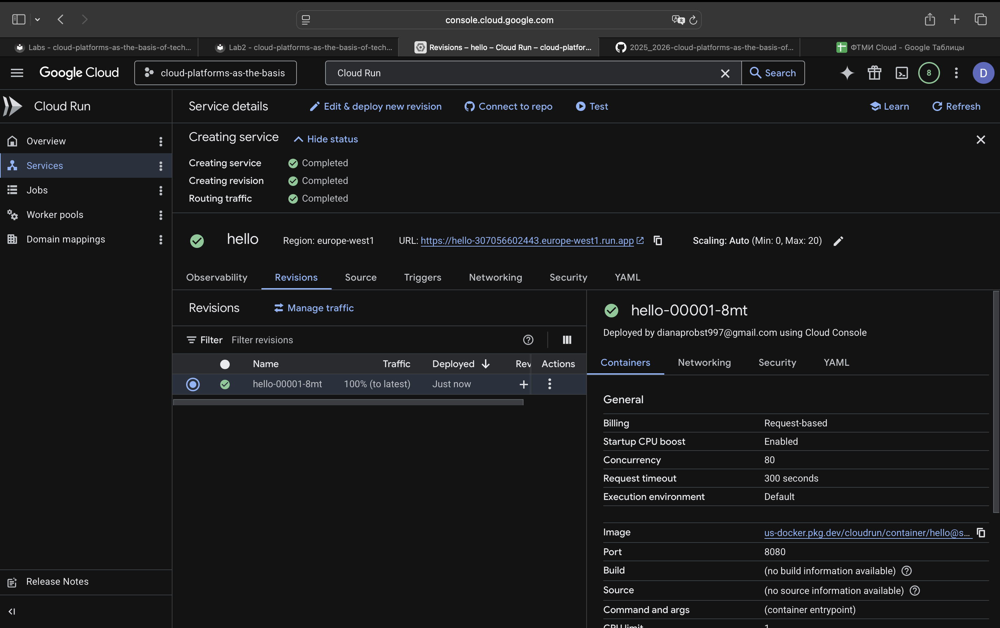
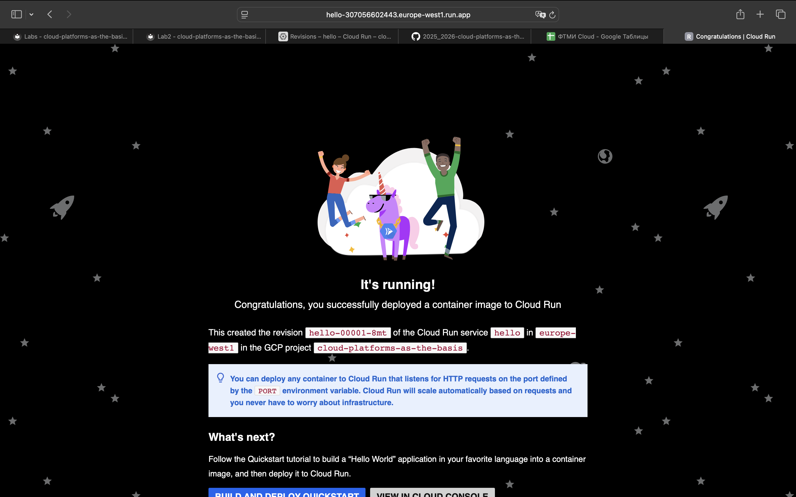
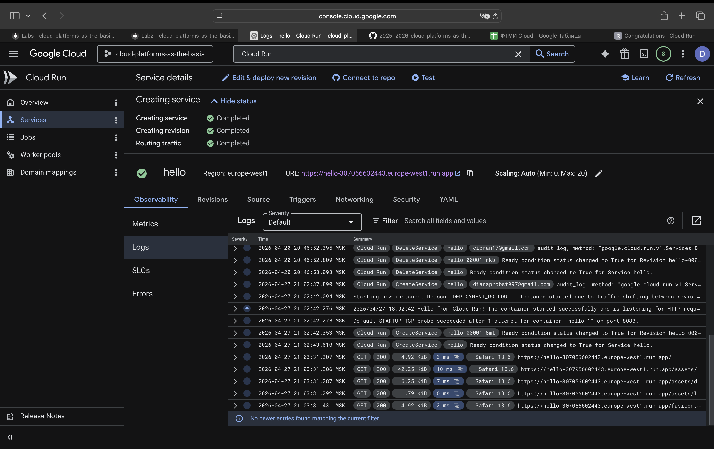
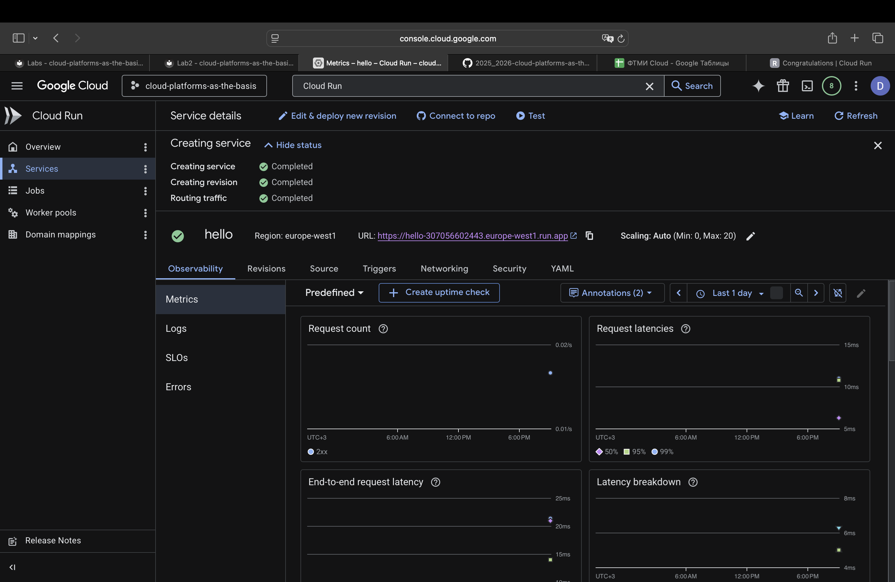
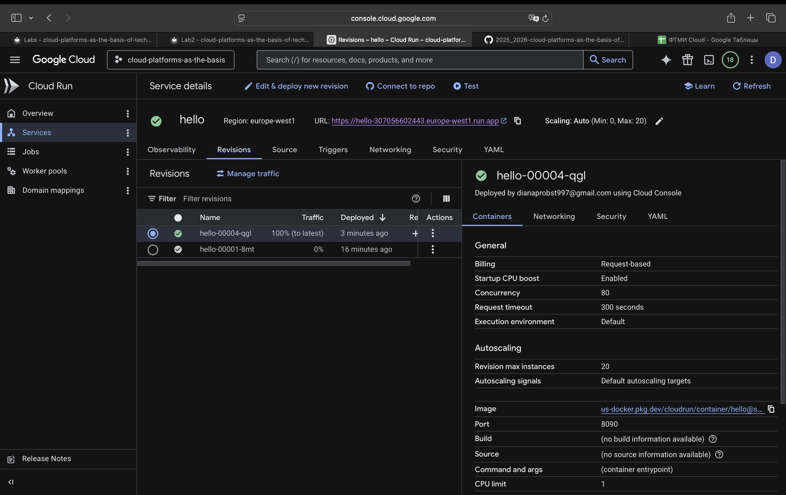
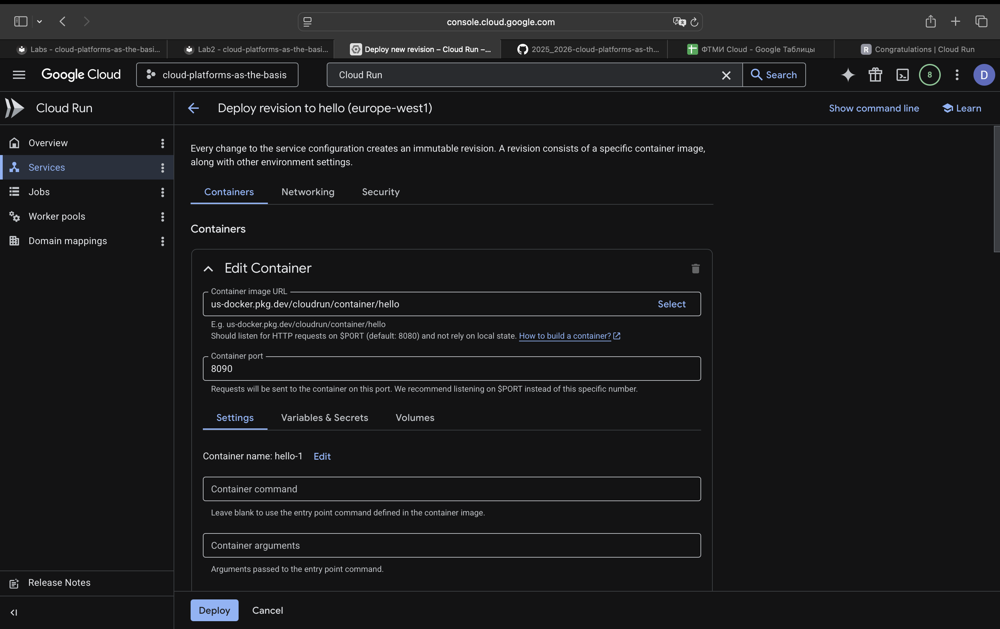
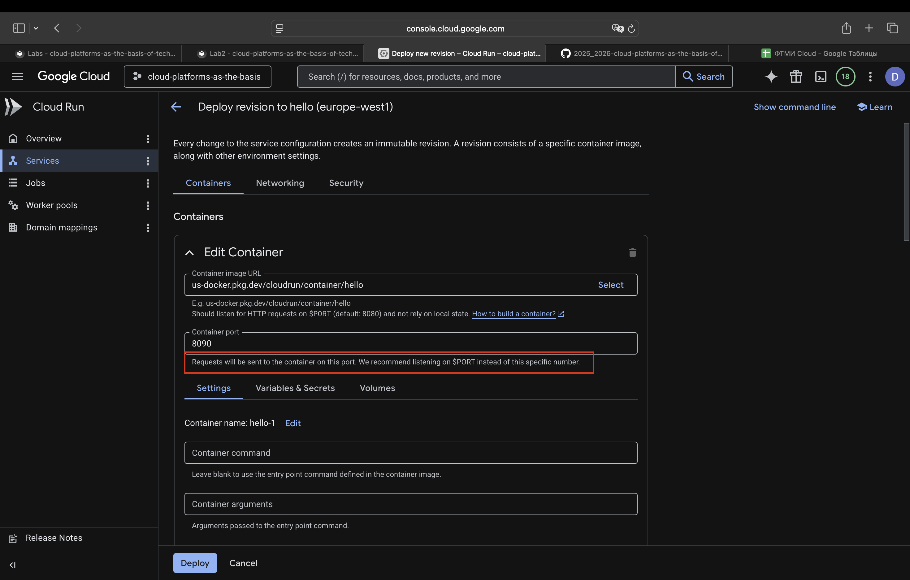

**University:** ITMO University  
**Faculty:** FTMI  
**Course:** Cloud Platforms as the basis of technology entrepreneurship 
**Year:** 2025/2026  
**Group:** U4125  
**Author:** Diana Pukhova  
**Lab:** Lab2  
**Date of create:** 20.04.2026  
**Date of finished:** 11.05.2026

# Лабораторная работа №2  
## Исследование Cloud Run

---

## Цель работы
Ознакомиться с облачным сервисом Cloud Run, изучить процесс развертывания контейнерного приложения, работу с логами, метриками, версиями (revisions) и управлением трафиком.

---

## 🛠️ Ход работы

### 1. Создание сервиса Cloud Run

Был создан новый сервис в Google Cloud Run с использованием стандартного демонстрационного образа **Hello World**.

Параметры развертывания:
- Платформа: Cloud Run
- Образ: стандартный hello-сервис
- Ресурсы:
  - CPU: 1
  - Memory: 256 MB (минимальная конфигурация)
- Порт контейнера: 8080 (по умолчанию)

После развертывания сервис получил публичный URL.

---

### 2. Проверка работы сервиса

Сервис был открыт по сгенерированной ссылке в браузере.

Результат:
- Сервис корректно возвращал ответ: `Hello World`
- Ошибок при запуске не наблюдалось

---

### 3. Анализ логов

Был открыт раздел **Logs** в Cloud Run.

В логах наблюдалось:
- Обработка HTTP-запросов
- Успешные ответы сервера
- Отсутствие ошибок

---

### 4. Анализ метрик

В разделе **Metrics** были изучены показатели:

- Количество запросов
- Время отклика
- Использование ресурсов

Сервис работал стабильно, без значительных задержек.

---

### 5. Работа с версиями (Revisions)

Были созданы несколько версий сервиса (revisions) в процессе изменения настроек.

Наблюдения:
- Каждое изменение создавало новую revision
- Активной всегда оставалась версия с 100% трафика
- Старые версии сохранялись, но не использовались

---

### 6. Переключение трафика

Была изучена возможность распределения трафика между версиями.

Проверено:
- 100% трафика → одна версия
- 0% трафика → неактивные версии

Вывод:
- Cloud Run позволяет безопасно переключать версии без остановки сервиса

---

### 7. Изменение порта контейнера

Была выполнена попытка изменить порт контейнера на значение `8090`.

Результат:
- Сервис продолжил работу без ошибок
- Изменение не повлияло на доступность приложения

Причина:
- Приложение использует переменную окружения `$PORT`
- Cloud Run автоматически маршрутизирует запросы

---

## ❗ Попытка получения ошибки 502

Была предпринята попытка вызвать ошибку 502 Bad Gateway путем изменения порта контейнера.

Результат:
- Ошибка 502 не была получена
- Сервис продолжил корректную работу

Вывод:
- Cloud Run не допускает ошибки при несовпадении порта, если приложение корректно использует `$PORT`
- Поведение системы зависит от конфигурации контейнера и активной revision

---

## 📊 Вывод

В ходе лабораторной работы был изучен облачный сервис Cloud Run.

Были выполнены следующие задачи:
- Создание и развертывание сервиса
- Проверка работы приложения
- Анализ логов и метрик
- Работа с версиями (revisions)
- Изучение распределения трафика
- Исследование поведения при изменении конфигурации порта

Также было установлено, что Cloud Run использует модель гибкого управления портами через переменную `$PORT`, что обеспечивает устойчивость сервиса к некорректным настройкам.

---

## 📎 Итог

Cloud Run предоставляет удобный механизм деплоя контейнеров с автоматическим управлением масштабированием, версиями и трафиком, обеспечивая стабильную работу даже при изменении конфигурации.
