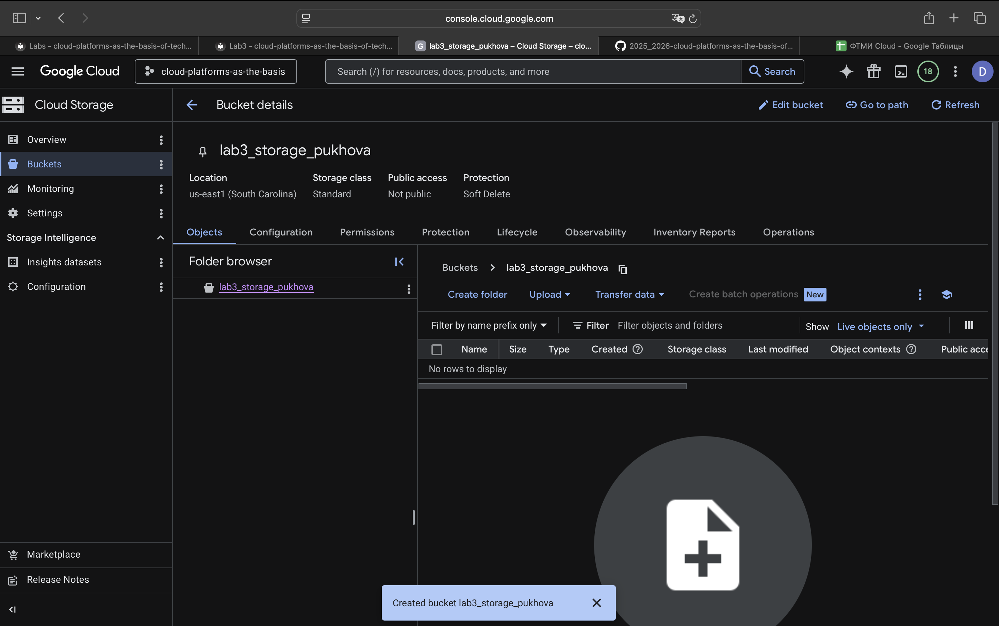
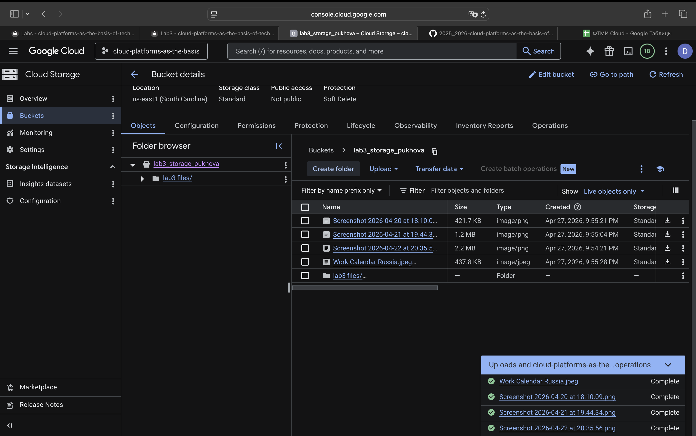
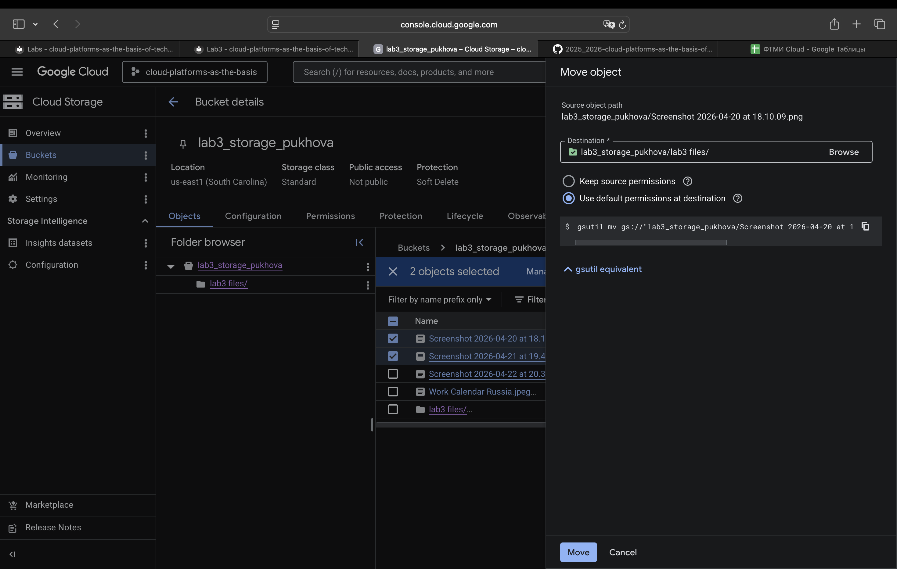
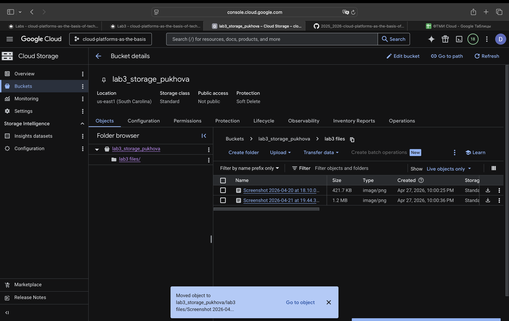
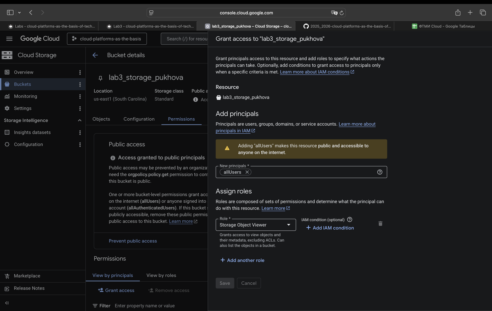
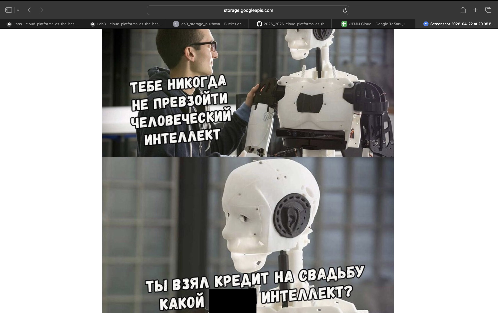

**University:** ITMO University  
**Faculty:** FTMI  
**Course:** Cloud Platforms as the basis of technology entrepreneurship 
**Year:** 2025/2026  
**Group:** U4125  
**Author:** Diana Pukhova  
**Lab:** Lab3
**Date of create:** 20.04.2026  
**Date of finished:** 11.05.2026

# Лабораторная работа №3  
## Исследование Cloud Storage

---

## 1. Цель работы

Ознакомиться с основными понятиями и принципами работы облачного хранилища, изучить различные модели хранения данных, а также познакомиться с основными сервисами и функционалом облачных хранилищ.

---

## 2. Используемая платформа

Google Cloud Platform (Cloud Storage)

---

## 3. Ход выполнения работы

### 3.1 Выбор проекта
Был выбран существующий проект в Google Cloud Console, в котором были предоставлены необходимые права доступа.

---

### 3.2 Создание Cloud Storage bucket

Был создан новый bucket в сервисе Cloud Storage.

Параметры создания:
- Уникальное имя bucket - lab3_storage_pukhova
- Тип расположения: Region
- Регион: ближайший

После создания bucket стал доступен в списке хранилищ.

---

### 3.3 Загрузка файлов

В созданный bucket было загружено 4 изображения формата JPG/PNG.

Файлы успешно отобразились в интерфейсе Cloud Storage.

---

### 3.4 Создание папки и перемещение файлов

Внутри bucket была создана папка с названием `lab3 files`.

2 из 3 загруженных файлов были перемещены в созданную папку с использованием функции Move.

---

### 3.5 Настройка публичного доступа

Для каждого загруженного файла были изменены настройки доступа:

- Добавлен пользователь: `allUsers`
- Назначена роль: `Storage Object Viewer`

Также, чтобы можно было настроить публичный доступ, нужно было убрать ограничения публичного доступа. 
После этого файлы стали доступны публично через интернет.

---

### 3.6 Получение ссылок на файлы

Для каждого файла была получена публичная ссылка через контекстное меню (Copy URL).

Ссылки позволяют открыть изображения без авторизации.

---

### 3.7 Удаление ресурсов

После завершения работы:
- удалены все файлы из bucket
- удалена папка
- удалён сам bucket

Таким образом, все созданные ресурсы были корректно удалены.

---

## 4. Результаты работы

В ходе лабораторной работы были выполнены следующие задачи:
- создан Cloud Storage bucket
- загружены изображения
- создана папка и выполнено перемещение файлов
- настроен публичный доступ к файлам
- получены публичные ссылки
- удалены все созданные ресурсы

---

## 5. Вывод

В ходе выполнения лабораторной работы были изучены основы работы с облачным хранилищем Cloud Storage. Освоены навыки создания bucket, загрузки и организации файлов, настройки прав доступа и удаления ресурсов. Полученные знания могут быть применены для работы с облачными сервисами хранения данных.
